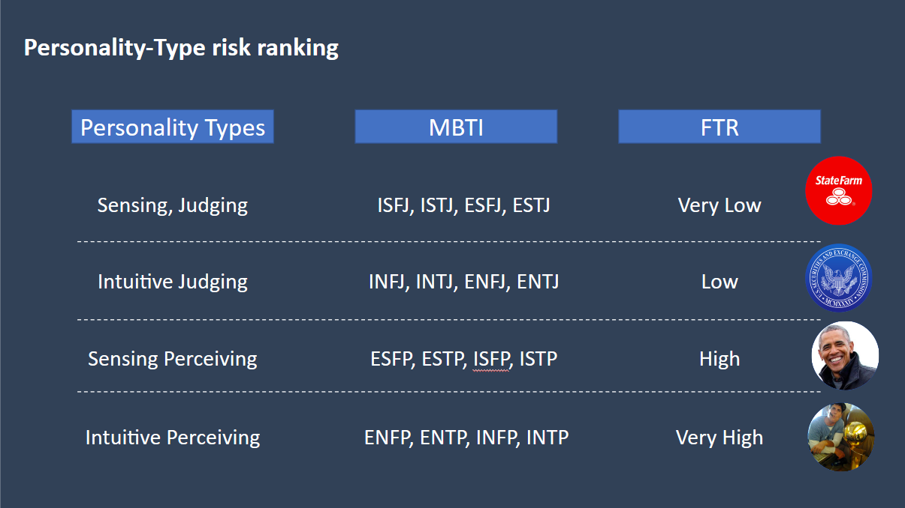

  

 

  <b><big> A Self Financial Wellness Assessment Tool (like a financial selfie) </big></b>

## 2nd place at Breaking Barriers Buildathon, by MIT FinTech, FINRA, and Deloitte
**Project Team:**
Nidhi Sharma, Kiran ChandreGowda, Mallika Saidi, Diego Benitez Concha, Yasmin Omrani, and Brian Vannah

**Advisors and Friends:**
Ada ZhouYing, Peter Smiley, Syed J. Zaidi, and Stephen Cohen

## Project Information

Check out the Solution Summary and Submission PDF for our design process and theoretical approach. For the social media portion of our project, we predicted financial risk tolerance given text as input. After training a model using the (MBTI) Myers-Briggs Personality Type Dataset from Kaggle, we used people's public Twitter accounts (specifically, the text in their tweets) to predict their Myers-Briggs personality type. We then used a mapping we found on the internet that correlated personality types to levels of financial risk (see diagrams below).
 
 

## Run it Yourself

### 1. Download the code.
Clone the repository, download the zip file, whatever.

### 2. Get a Twitter API key
The file `twitter_access.py` needs four API keys. Find the part in the file where it declares `consumer_key`, `consumer_secret`, `access_token`, and `access_token_secret`, and put your keys/tokens in there. You can apply for a Twitter development account (or ask a friend to borrow theirs but don't commit fraud).

### 3. Install the dependencies
You need Python 3, and a bunch of Python modules. My recommendation for the modules is to just install pip, and then try to run the main file (`get_risk.py`) and use pip to install the modules that it asks for.

### 4. Run the main file
Execute `get_risk.py` however you execute python scripts, usually something like `python3 get_risk.py` in terminal, or run it using your IDE of choice (IDLE or Spyder for many people).

Shoot me a text, email, etc. if you have questions.
-Brian
